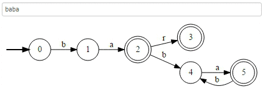
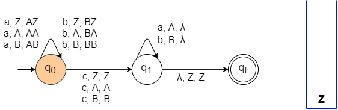
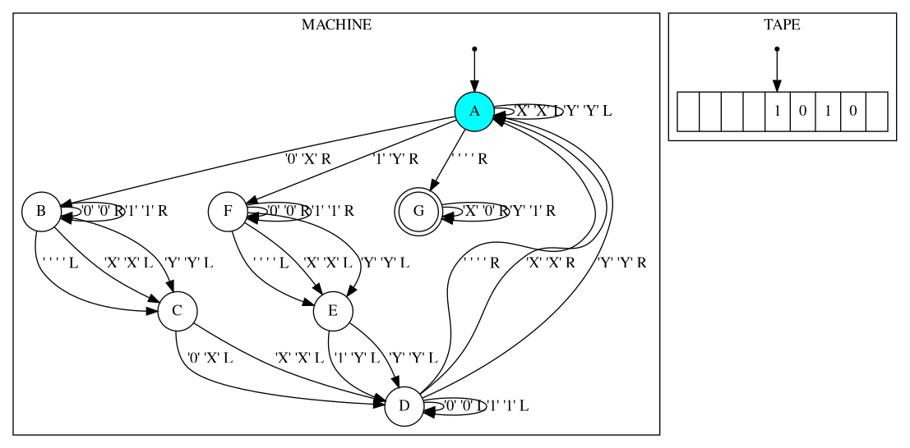
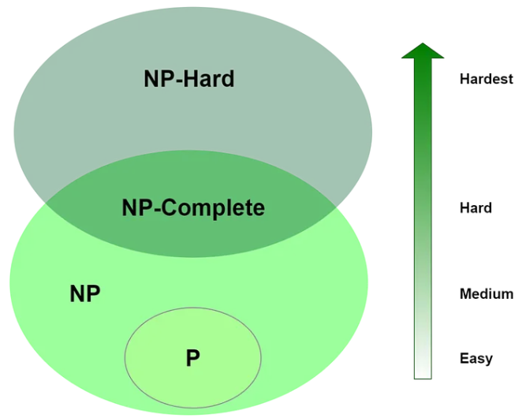
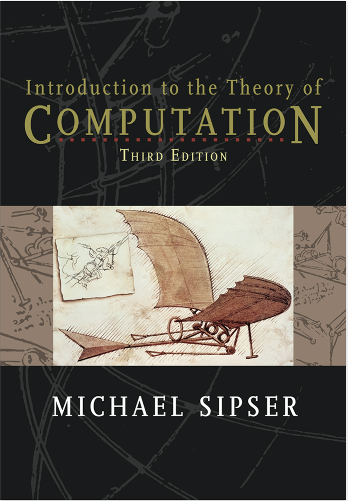
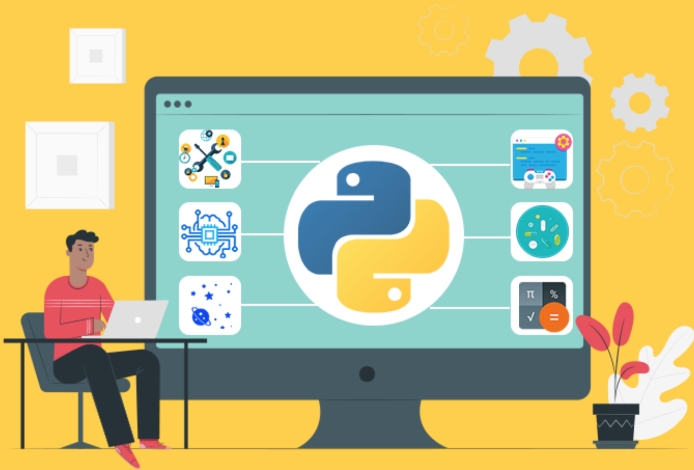

#              CONTENIDO {.center}

## UNIDAD 1 {.center}

-   [Nociones de Computabilidad y Autómatas]{style="color:green;"}

    1.  Teoría de la Computación
    2.  Fundamentos Matemáticos
    3.  Autómatas Finitos \
    Deterministicos
    4.  Lenguajes Regulares

::: r-stack
{.r-stretch .fragment .absolute top="250" left="550" width="600" height="230"}
:::

## UNIDAD 2 {.center}

-   [No Determinismo y Lenguajes Libres de Contexto]{style="color:green;"}

    1.  Autómatas Finitos No Deterministicos
    2.  Expresiones Regulares
    3.  Lenguajes y Gramáticas \
    Libres de Contexto
    4.  Autómatas con Pila

::: r-stack
{.r-stretch .fragment .absolute top="250" left="480" width="700" height="250"}
:::

## UNIDAD 3 {.center}

-   [Teoría y Computabilidad Avanzada de Autómatas]{style="color:green;"}

    1.  Lenguajes Turing Reconocibles
    2.  Máquinas de Turing
    3.  La Tesis de Church Turing
    4.  Decidibilidad

::: r-stack
{.r-stretch .fragment .absolute top="250" left="505" width="650" height="360"}
:::

## UNIDAD 4 {.center}

-   [Complejidad Computacional Avanzada]{style="color:green;"}

    1.  Indecidibilidad
    2.  Conjuntos contables e incontables
    3.  Reducibilidad
    4.  Problemas tratables e intratables

::: r-stack
{.r-stretch .fragment .absolute top="250" left="700" width="450" height="400"}
:::

## BIBLIOGRAFIA {.center}

::: r-stack
{.r-stretch .fragment .absolute top="70" left="330" width="400" height="500"}
:::

## SOFTWARE {.center}

::: r-stack
{.r-stretch .fragment .absolute top="70" left="200" width="600" height="400"}
:::

## TOOLS {.center}

- [https://www.jflap.org](https://www.jflap.org)

## PREGUNTAS... {.center}

::: r-stack
{.r-stretch .fragment .absolute top="70" left="0" width="1000" height="600"}
:::
