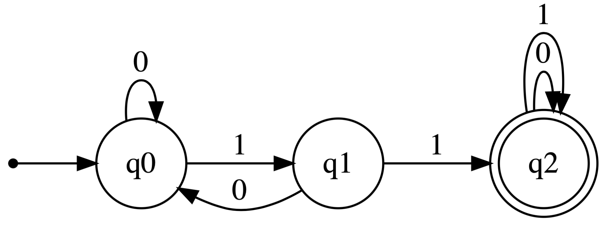
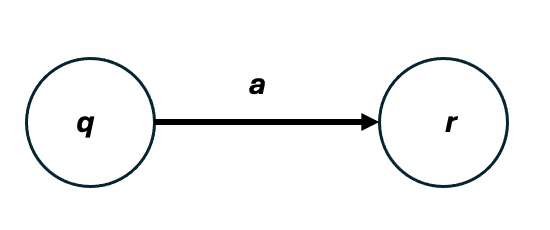

```{r setup, include=FALSE}
knitr::opts_chunk$set(cache = TRUE, echo = FALSE, warning = FALSE, message = FALSE)
```

## Propósito de la Sesión {.center}

- Conocer los **fundamentos** y **áreas** de la Teoría de la Computación.

- Conocer los fundamentos Matemáticos de la Teoría de la Computación.

- Aprender y Evaluar los **Autómatas** Finitos Deterministicos y Lenguajes Regulares. 

## Contenidos a tratar {.center}

1. Motivación.
2. Fundamentos de la teoría de la computación.
3. Autómatas finitos deterministos.
4. Lenguajes regulares.


##                           MOTIVACIÓN {.scrollable}

-   [¿Cuáles son las capacidades y limitaciones fundamentales de las computadoras?]{style="color:magenta;"}

    -   Areas: [Autómatas, Computabilidad y Complejidad.]{style="color:green;"}

-   Historia: Concepto de **Computación** por [Alan Turing](https://gradschool.princeton.edu/about/viget-honor-roll/alan-mathison-turing) y Alonzo Church, 1930.

-   Actualidad: Avances científicos y tecnológicos an incrementado nuestra capacidad de `computar` (Computación de alto rendimiento, computación cuántica).

- [VERITASIUM: Las Matemáticas Tienen Una FALLA Descomunal
](https://www.youtube.com/watch?v=RRg38oNQ9vk) \ ([Attention! ... is all you need :) - min:22]{style="color:gold;"})

##             TEORÍA DE LA COMPUTACIÓN {.scrollable}

### ¿Qué es?

- Rama de la **Ciencia de Computación**.

- Estudio FORMAL y ABSTRACTO de las [**COMPUTADORAS**]{style="color:green;"}.
    
    - Que pueden hacer (qué problemas pueden resolverse mediante procedimientos computacionales).
    - Cómo lo hacen (cuánto tiempo y memoria se requiere para resolver problemas).
    - Cuáles son sus límites fundamentales (qué problemas NO pueden resolver).

##             TEORÍA DE LA COMPUTACIÓN {.scrollable}

### Areas

-   `Autómatas`: Modelos matemáticos de máquinas abstractas. Se estudia los problemas que pueden resolver.

    -   Autómatas finitos, Autómatas con pila (memoria), Máquinas de Turing.

-   `Computabilidad`: Examina qué problemas pueden ser resueltos por computadoras y cuáles no.

    -   [Problemas Decidibles]{style="color:green;"}: Problemas para los cuales existe un algoritmo que puede determinar la solución en un tiempo finito.
    -   [Problemas Indecidibles]{style="color:red;"}: Problemas para los cuales no existe un algoritmo que pueda determinar la solución para todos los casos posibles.

-   `Complejidad`: Clasifica los problemas según los recursos computacionales necesarios para resolverlos (tiempo y espacio).

    -   **P (Tiempo Polinómico)**: Conjunto de problemas que pueden ser [resueltos]{style="color:green;"} por una máquina de Turing determinista en tiempo polinómico. Representa los problemas que son "fácilmente" solucionables.
    -   **NP (Tiempo No Determinista Polinómico)**: Conjunto de problemas cuyas soluciones pueden ser [verificadas]{style="color:magenta;"} por una máquina de Turing determinista en tiempo polinómico. Incluye problemas que pueden no ser fácilmente solucionables, pero cuyas soluciones pueden ser verificadas rápidamente.

    - El problema del Milenio $P \neq NP$ [https://www.claymath.org/millennium/p-vs-np/](https://www.claymath.org/millennium/p-vs-np/)

##            CONCEPTOS FUNDAMENTALES  {.scrollable}

- **ALFABETO**: Conjunto de símbolos

    - $\Sigma_1=\{0,1\}, \Sigma_2=\{a,b,,...,z\}$

- **CADENA**: Secuencia de símbolos

    - $w=01001$ sobre $\Sigma_1$
    - $\alpha=abracadabra$ sobre $\Sigma_2$
    - Longitud de una cadena: $|w|=5$, $|\alpha|=11$
    - Cadena nula $\epsilon$ con $|\epsilon|=0$
    - En general : Si $w=w_1w_2...w_n$, entonces $|w|=n$
    - Concatenación: $x=x_1x_2...x_m$ y $y=y_1y_2...y_n$ entonces $xy=x_1x_2...x_my_1y_2...y_n$ 
    - El orden de todas las cadenas del alfabeto $\Sigma_1=\{0,1\}$ es: ($\epsilon$$,0, 1, 00, 01,10,11,000,...$)
- **LENGUAJE**: Es un conjunto de cadenas definidas sobre un alfabeto.

    - $L=\{0,00,11,000,111,0000,...\}$ sobre $\Sigma_1=\{0,1\}$

##                        AUTOMATA FINITO {.scrollable}

- Automata Finito Deterministico: $M_1$


```{r, include=FALSE}
library(reticulate)
#py_install("visual_automata")
use_virtualenv("r-reticulate", required = TRUE)
py_config()
```

```{python}
#| echo: true
from automata.fa.dfa import DFA
from visual_automata.fa.dfa import VisualDFA

dfa = VisualDFA(
    states={'q0', 'q1', 'q2'},
    input_symbols={'0', '1'},
    transitions={
        'q0': {'0': 'q0', '1': 'q1'},
        'q1': {'0': 'q0', '1': 'q2'},
        'q2': {'0': 'q2', '1': 'q2'}
    },
    initial_state='q0',
    final_states={'q2'}
)
graph = dfa.show_diagram()
diagrama = graph.source
#diagrama.table
```

```{r}
#| echo: true
library(DiagrammeR)
DiagrammeR::grViz(py$diagrama)
```


- Estados: $q_0,q_1,q_2$
- Transición: $\overset{1}{\longrightarrow}$ y $\overset{0}{\longrightarrow}$
- Estado Inicial: $q_0$
- Estados de Aceptación: $\{q_2\}$

- Relación: AUTOMATA y ALGORITMO:

    - Entrada: cadena finita $01101$, $00101$ 

    - Proceso de Computación: `Comenzar en el estado inicial, leer los simbolos de entrada, siguiendo las correspondientes transciones , ACEPTAR si termina en el estado de aceptación, RECHAZAR si no.`

    - Salida: `Aceptar` o `Rechazar` 

    - EJEMPLOS:
        
        - {width=50%}
        - $01101$: ACEPTA
        - $00101$: RECHAZA

- EL conjunto de cadenas que $M_1$ acepta se llama **Lenguaje** de $M_1$: denotado por: $L(M_1)=A$. 
- $M_1$ reconoce $A$

    - $A=\{w| w \mbox{ contiene la subcadena } 11\}$


##                        AUTOMATA FINITO {.scrollable}

- **Definición Formal**: Un automata finito $M$ es una 5-tupla $(Q,\Sigma,\delta,q_0,F)$

    - $Q$: Conjunto finito de estados
    - $\Sigma$: Alfabeto (conjunto finito de simbolos)
    - $\delta$: Función de transición 
    
        - $\delta:Q\times \Sigma \longrightarrow Q$
        - $\delta(q,a)=r$
        - {width=40%}
        
    - $q_0$: Estado inicial
    - $F$: Conjunto de estados de aceptación
    
- Ejemplo: $M_1$

    - $M_1=(Q,\Sigma,\delta,q_0,F)$
    - $Q=\{q_0,q_1,q_2\}$
    - $\Sigma=\{0,1\}$
    - $F=\{q_2\}$

- {width=50%}


```{r, include=FALSE}
library(reticulate)
#py_install("visual_automata")
use_virtualenv("r-reticulate", required = TRUE)
py_config()
```


```{python}

import pandas as pd
from automata.fa.dfa import DFA

# 1. Define the DFA (example: binary strings ending in an odd number of '1's)
dfa = DFA(
    states={'q0', 'q1', 'q2'},
    input_symbols={'0', '1'},
    transitions={
        'q0': {'0': 'q0', '1': 'q1'},
        'q1': {'0': 'q0', '1': 'q2'},
        'q2': {'0': 'q2', '1': 'q2'}
    },
    initial_state='q0',
    final_states={'q2'}
)

# 2. Convert transitions to a Pandas DataFrame
df = pd.DataFrame(dfa.transitions).T.fillna('-')

# 3. Rename axis and index for a clean table appearance
df.index.name = ""
df.columns.name = "𝛿"

# 4. Display in Quarto
df
```


##                        AUTOMATA FINITO {.scrollable}

- **Definición Formal de Computación**: Un automata finito $M$ acepta una cadena $w=w_1w_2...w_n$ con $w_i\in \Sigma$, si existe una secuencia de estados $r_0,r_1,r_2,...,r_n \in Q$ donde:

    - $r_0=q_0$
    - $r_i=\delta (r_{i-1},w_i) \mbox{ para } 1\leq i \leq n$
    - $r_n \in F$
    
- **Lenguajes Reconocibles**

    - $L(M)=\{w|M \ acepta  \ w \}$
    - $L(M)$ es el lenguaje de $M$
    - $M$ reconoce $L(M)$

- **Lenguaje Regular**: Un lenguaje es **REGULAR** si algún automata finito lo reconoce. 


##                    EXPRESIONES REGULARES {.scrollable}

- **Operaciones Regulares**: Sean $A,B$ lenguajes.

    - Unión: $A\cup B=\{ w|w\in A \ or \ w\in B \}$
    - Concatenación: $A\circ B=\{ xy|x\in A \ and \ y\in B \}=AB$
    - Estrella (Kleene): $A^*=\{ x_1...x_k| x_i\in A \ for \  k\geq 0 \}$ (nota: $\epsilon \in A^*$)


- **Expresiones Regulares**: Es una notación formal utilizada para describir conjuntos de cadenas sobre un alfabeto. Formalmente, las expresiones regulares se definen recursivamente, Sea $\Sigma$ un alfabeto:

    - $\phi$ es una expresión regular y representa el lenguaje vacío.
    - $\epsilon$ es una expresión regular y representa el conjunto que contiene la cadena vacía.
    - Para cada símbolo $a\in \Sigma$, $a$ es una expresión regular que representa el lenguaje $\{a \}$
    - Si $R$ y $S$ son expresiones regulares, entonces tambien son expresiones regulares:
        
        - $R\cup S$
        - $R \circ S$
        - $R^*$
        
- Ejemplos: 

    - $(0\cup 1)^*=\Sigma^*$ todas las cadenas sobre $\Sigma$

    
    
    
    
    
## ¿Qué aprendimos hoy? {.center}


- En esencia, la teoría de la computación es una disciplina matemática que busca entender:

    - La naturaleza de los algoritmos.
    - El poder de las computadoras.
    - Las fronteras de lo computable y eficiente.
    
- Fundamentos de la Teoría de la Computación.
- Autómatas finitos deterministos.
- Lenguajes regulares.

## Referencias Bibliografícas {.center}

- Sipser, M. (2013). *Introduction to the theory of computation* (3.ª ed.). *Cengage Learning*.

    - CAP. 0, pag. 1-25
    - CAP. 1, pag. 31-82   


## PREGUNTAS... {.center}


